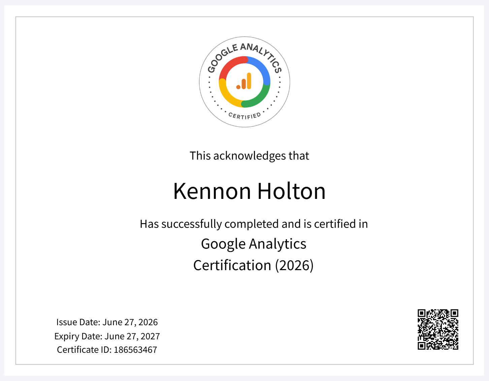

This page highlights my work with Google Analytics 4 and how web analytics can support better marketing and business decisions.

## Certification

I completed the Google Analytics Certification in 2026. This certification supports my understanding of digital measurement, website behavior, events, conversions, and marketing performance analysis.

## Project Overview

For this project, I worked with Google Analytics 4, also known as GA4. GA4 is used to measure how people interact with websites and apps. It helps businesses understand where users come from, what actions they take, and whether those actions support business goals.

The main purpose of this work was to understand how analytics can connect user behavior to decision-making. Instead of only looking at traffic numbers, GA4 helps show what people actually do after arriving on a website.

## Key Concepts

### Data Streams

A data stream is the source of data flowing into a GA4 property. A company may have a website data stream, an app data stream, or both. This allows GA4 to collect information from different digital platforms in one place.

### Events

GA4 uses events to track user interactions. Events can include actions such as page views, clicks, scrolls, form submissions, video plays, and purchases.

This is important because modern analytics is not only about counting visits. It is about understanding specific behaviors.

### Conversions

Conversions are important events that connect to business goals. For example, a purchase, sign-up, lead form submission, or demo request could be marked as a conversion.

Conversions help a business measure whether its website is actually producing useful outcomes.

### Realtime Reports

Realtime reports show what users are doing on a website or app in the last 30 minutes. This can help confirm whether tracking is working and whether users are currently active.

Realtime reporting is useful for testing campaigns, checking new tracking setups, and monitoring live activity.

## Business Value of GA4

GA4 is valuable because it helps businesses make better decisions with actual user behavior data. A business can use GA4 to answer questions such as:

- Where are visitors coming from?
- Which pages are attracting attention?
- Which actions are users taking?
- Are users completing important goals?
- Which campaigns appear to be driving useful traffic?

This kind of information can help marketing teams improve campaigns, website content, and user experience.

## Example Use Case

A company running a digital marketing campaign could use GA4 to evaluate whether the campaign is working. The team could review traffic sources, user engagement, events, and conversions.

For example, if a campaign drives many visitors but very few conversions, the business may need to improve the landing page, adjust the audience targeting, or change the call to action.

If a campaign drives fewer visitors but a higher conversion rate, that traffic may be more valuable even if the overall volume is smaller.

## Skills Demonstrated

This project helped me practice skills related to digital analytics and marketing measurement, including:

- Navigating GA4 reports
- Understanding events and conversions
- Reviewing realtime user activity
- Connecting website behavior to business goals
- Thinking critically about marketing performance
- Using analytics to support decision-making

## Reflection

GA4 is useful because it helps move marketing analysis beyond surface-level metrics. Page views and traffic are helpful, but they do not tell the full story. A stronger analysis looks at what users do, whether they engage, and whether their actions support the goals of the organization.

This connects directly to my career interests because I want to work in roles that combine strategy, technology, and data. GA4 is one example of how digital tools can help leaders understand performance and make better decisions.
